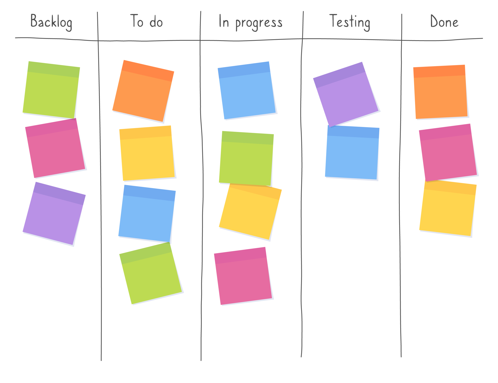

# FINAL-AP-12.2024-Nakagawa

## Proyecto
La aplicación de gestión de flujo de trabajo está diseñada para que los equipos gestionen proyectos, tareas y colaboradores de manera eficiente. Ofrecemos herramientas simples, intuitivas y accesibles en todo momento, enfocándonos en mejorar la productividad, la organización interna y la colaboración entre los miembros del equipo. Nuestro objetivo es facilitar el flujo de trabajo y optimizar el tiempo empleado en las tareas diarias.

---

## Objetivos Generales SMART

### Específico
Diseñar y desarrollar una aplicación de gestión de flujo de trabajo que permita a los equipos crear, asignar y monitorear tareas, gestionar proyectos y mejorar la colaboración en el equipo.

### Medible
Lograr que al menos el 80% de los usuarios dentro de los equipos adopten la aplicación dentro de los primeros 3 meses posteriores al lanzamiento oficial.

### Alcanzable
Implementar las funcionalidades básicas como creación y asignación de tareas, gestión de proyectos y reportes de avance, utilizando tecnologías probadas y accesibles para el equipo de desarrollo.

### Relevante
Mejorar la productividad organizacional y la capacidad de coordinación de equipos, respondiendo a la creciente necesidad de herramientas digitales para la gestión eficiente del tiempo y los recursos.

### Temporal
Completar el desarrollo de la aplicación con sus funcionalidades principales en un plazo de 6 meses, con iteraciones mensuales para pruebas y ajustes según el feedback de los usuarios.

---

## Milestones del Proyecto

### Milestone 1: **Relación de Áreas en una Base de Datos Compleja**
- **Descripción:** Diseñar e implementar una base de datos robusta que permita gestionar la relación entre proyectos, colaboradores y tareas. Esto incluirá la capacidad de modificar colaboradores asignados a un proyecto, reconfigurar tareas asociadas y garantizar la trazabilidad de los cambios.
- **Objetivo:** Crear una estructura que soporte las interacciones complejas entre los datos para ofrecer flexibilidad en la gestión de proyectos.
- **Fecha límite:** **1 mes** desde el inicio del proyecto.

#### Tareas asociadas:
1. Diseño del esquema de base de datos relacional para soportar múltiples dependencias entre proyectos, colaboradores y tareas.
2. Implementación de APIs para la modificación dinámica de colaboradores y tareas asociadas a proyectos.
3. Validación de integridad referencial y pruebas de las relaciones en la base de datos.

## Milestone 2: **Hashing de Datos Sensibles de los Colaboradores**
- **Descripción:** Proteger la información sensible de los colaboradores mediante técnicas de hashing para datos como contraseñas, y cifrado para otros datos confidenciales.
- **Objetivo:** Garantizar la seguridad de los datos sensibles almacenados en la base de datos cumpliendo con buenas prácticas de seguridad.
- **Fecha límite:** **2 meses** después del inicio del proyecto.

**Tareas asociadas:**
1. Implementar el hashing seguro (ej.: bcrypt) para las contraseñas de los colaboradores.
2. Realizar auditorías de seguridad para garantizar la implementación adecuada.
3. Documentar el enfoque de seguridad y cómo se integran las técnicas utilizadas en el sistema.

---

## Riesgos identificados

<table>
  <tr>
    <th>Riesgo</th>
    <th>Probabilidad</th>
    <th>Impacto</th>
    <th>Nivel de riesgo</th>
  </tr>
  <tr>
    <td>Baja adopción por parte de los usuarios</td>
    <td> Media</td>
    <td> Alta</td>
    <td> Alta</td>
  </tr>
  <tr>
    <td>Problemas técnicos durante el despliegue</td>
    <td> Media</td>
    <td> Alta</td>
    <td> Alta</td>
  </tr>
  <tr>
    <td>Cambios en los requisitos del cliente</td>
    <td> Alta</td>
    <td> Media</td>
    <td> Alta</td>
  </tr>
</table>

## Detalles de los Riesgos

### Baja adopción por parte de los usuarios
Es fundamental realizar una capacitación adecuada y brindar soporte para asegurar que los empleados comprendan el uso de la herramienta.

### Problemas técnicos durante el despliegue
Invertir en pruebas exhaustivas antes del lanzamiento para minimizar inconvenientes.

### Cambios en los requisitos del cliente
Implementar metodologías ágiles que permitan adaptarse rápidamente a nuevas demandas.

---

### Factibilidad técnica y económica

#### **Factibilidad técnica** 

1. **Herramientas y tecnologías disponibles:**  
   - Verificar si el equipo cuenta con el hardware y software necesario para el desarrollo, como computadoras, IDEs, frameworks, lenguajes de programación, bases de datos y servidores.  
   - Evaluar si la infraestructura (nube o servicios de hosting) soporta los requisitos de la aplicación.  

2. **Conocimientos técnicos del equipo:**  
   - Determinar si los integrantes del equipo tienen experiencia en las tecnologías requeridas.  
   - Si hay brechas de conocimiento, prever capacitación o incorporar nuevos perfiles al equipo.  

3. **Plazo de entrega:**  
   - Confirmar si las soluciones tecnológicas elegidas permiten cumplir con los tiempos establecidos sin comprometer la calidad.  

4. **Escalabilidad y mantenimiento:**  
   - Verificar si las herramientas seleccionadas permitirán que la aplicación crezca en funcionalidad o usuarios en el futuro sin necesidad de grandes cambios.  

---

#### **Factibilidad económica**  

1. **Costos de desarrollo:**  
   - **Infraestructura:** Gastos en servidores, bases de datos, servicios en la nube o licencias de software.  
   - **Equipo humano:** Salarios de desarrolladores, diseñadores, testers y demás roles del equipo.  
   - **Capacitación:** Inversión en formación técnica si el equipo requiere aprender nuevas tecnologías.  

2. **Costos de mantenimiento:**  
   - Actualizaciones y mejoras continuas.  
   - Solución de problemas y soporte técnico.  
   - Costos operativos como hosting, monitoreo y servicios en la nube.  

3. **Recursos disponibles:**  
   - Comparar el presupuesto total disponible (ahorros, inversión externa, ingresos proyectados) con los costos estimados.  
   - Evaluar si es necesario buscar financiamiento externo (por ejemplo, inversores, rondas de capital, préstamos).  

4. **Análisis de retorno de inversión (ROI):**  
   - Calcular cuánto tiempo tardará el proyecto en generar ingresos suficientes para cubrir los costos iniciales y comenzar a ser rentable.  
   - Identificar fuentes de ingresos (suscripciones, publicidad, licencias, etc.).  

---

## Análisis de Costos

<table>
  <thead>
    <tr>
      <th>Total</th>
      <th>Producción</th>
      <th>Administración</th>
      <th>Venta</th>
      <th>Financieros</th>
    </tr>
  </thead>
  <tbody>
    <tr>
      <td rowspan="4">$42,500,000</td>
      <td>Desarrolladores (3 desarrolladores, 6 meses): $26,712,000</td>
      <td>Sueldos: $6,000,000</td>
      <td>Marketing: $1,500,000</td>
      <td>Intereses de financiación: $800,000</td>
    </tr>
    <tr>
      <td>Infraestructura (hosting, nube): $5,000,000</td>
      <td>Gastos generales (oficina, servicios, software): $1,000,000</td>
      <td>Departamento comercial: $1,200,000</td>
      <td>Préstamos: $3,000,000</td>
    </tr>
    <tr>
      <td>Soporte y mantenimiento anual: $3,000,000</td>
      <td></td>
      <td>Logística: $500,000</td>
      <td></td>
    </tr>
  </tbody>
</table>

---

### Costo de Oportunidad

El presupuesto total asignado es de **$42,500,000**.

1. **Alternativa no elegida:**
   - Invertir en un proyecto comercial con un retorno estimado de **$60,000,000**.
   - Realizar inversiones en el mercado financiero con una tasa de retorno anual promedio del **8%**, lo que generaría **$3,400,000** en un año sobre el capital invertido.

2. **Cálculo del costo de oportunidad:**
   - **Proyecto alternativo:**  
     $60,000,000 (beneficio estimado) - $42,500,000 (inversión en este proyecto) = **$17,500,000**.
   - **Inversión financiera:**  
     $3,400,000 (retorno anual de la inversión financiera).

3. **Conclusión:**
   El costo de oportunidad para este proyecto es de **$17,500,000**.

---

# Frontera de Posibilidad de Producción (FPP)

- **Desarrollo del producto** (calidad del software, funcionalidades)
- **Marketing y ventas** (promoción, expansión de usuarios)
- **Mantenimiento y soporte** (actualizaciones y resolución de problemas)

## Supuestos:
- El presupuesto total de **$42,500,000** es limitado.
- El recurso principal son los fondos disponibles (financieros).
- La productividad de cada área (Desarrollo, Marketing, Soporte) tiene **retornos decrecientes** (es decir, por cada unidad adicional de inversión, el retorno disminuye).
- Existe una **relación trade-off**: más inversión en una área implica menos recursos disponibles para las demás.

# Análisis de Beneficios

Suponiendo que **P = 15.000** (el costo de la suscripción mensual) y **Q = 195** (número de empresas). Entonces:

$$
F(x) = 100 \times 500 = 50,000 \quad (\text{beneficio mensual})
$$

### **Cálculo del Valor Presente Neto (VPN)**

El **VPN** nos permite determinar si este proyecto es rentable al compararlo con elmercado financiero (8% anual / 0.67% mensual).  

- **Inversión inicial**: $42,500,000.  
- **Flujos mensuales proyectados**: $2,916,667 (basados en un beneficio total esperado de $17,500,000 en 6 meses).  

1. En base a la formula del VPN calculamos los flujos descontados para cada mes. La suma de todos los flujos proyectados a valor presente es de aproximadamente **$17,320,460**.  
2. Restamos la inversión inicial:  
   
   VPN = 17,500,460 - 42,500,000 = -25,000,000.
   

#### **Conclusión**:  
El VPN es **negativo (-$25,000,000)**, lo que significa que este proyecto no es rentable frente a las alternativas.

#Metodología de Desarrollo: Scrum

Para este proyecto, seleccione la **metodología ágil Scrum**, debido a sus características que Scrum es ideal para entornos de desarrollo de software con cambios frecuentes y para equipos que buscan mantenerse alineados con las expectativas del cliente.

## Justificación

### 1. **Iteración y Flexibilidad**
La metodología Scrum permite realizar entregas incrementales a través de **sprints** (ciclos cortos de trabajo), lo que facilita la implementación de nuevas funcionalidades y la corrección de errores de manera continua. Además, se adapta a cambios en los requisitos del cliente durante todo el proceso de desarrollo.

### 2. **Enfoque en el Usuario**
Scrum promueve una colaboración constante con los stakeholders. Esta interacción asegura que el producto final cumpla con las expectativas de los usuarios y mejore con cada iteración.

### 3. **Gestión de Riesgos**
Dado que uno de los riesgos identificados es la baja adopción de la herramienta, Scrum permite realizar **pruebas frecuentes** con los usuarios, obteniendo retroalimentación inmediata que puede ser utilizada para ajustar el producto y facilitar la adopción.

### 4. **Visibilidad y Control**
Scrum brinda visibilidad del progreso del proyecto a través de **reuniones diarias** y revisiones regulares, lo que permite detectar problemas rápidamente y ajustar el rumbo si es necesario. Esto es crucial para cumplir con el objetivo de entregar la aplicación en un plazo de **6 meses**.

## Conclusión

La metodología Scrum se alinea perfectamente con los objetivos del proyecto, permitiendo iterar sobre el desarrollo de funcionalidades y ajustarse a nuevas necesidades sin comprometer la calidad del producto final.

---
##Kanban

##Explicación del proceso de gestión de riesgos

La gestión de riesgos es el proceso de identificar, evaluar y priorizar los riesgos que pueden afectar el éxito de un proyecto. Una vez identificados los riesgos, se desarrollan estrategias para mitigarlos. Incluye monitorizar continuamente los riesgos durante todo el ciclo de vida del proyecto para asegurar que se tomen acciones cuando sea necesario.

### Estrategia de acción para el riesgo "Baja adopción por parte de los usuarios"

Para mitigar el riesgo de baja adopción, implementaremos un programa de capacitación para los usuarios y proporcionaremos soporte continuo para resolver dudas.
---

